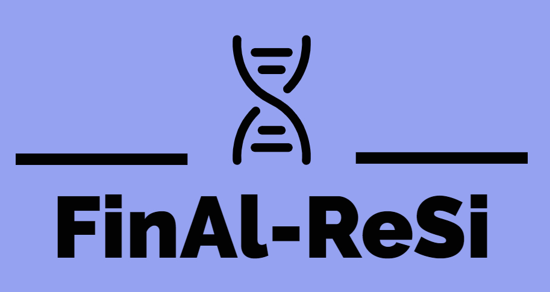

# FinAl-ReSi
### Find and Align Restriction Fragments

___

___

FinAl-ReSi is a pipeline to find  restriction fragments conserved among differnt strains/variants of a particular organism.
As a proof of concept, we are going to use FinAl-ReSi to find conserved sequences among SARS-CoV-2 variants. Then, these fragments 
will be used to trigger an EXPAR reaction by the following mechanism:

1- A primer hybridizes to the virus RNA, close to a BstNI site.

2- It has been reported that Bst DNA polymerase 3.0 has RT activity (Bekta¸s et al., 2021). Then, this enzyme would extend this primer, creating the first cDNA.

3- It has been shown that the restriction enzyme BstNI can cut the DNA strand on a DNA:RNA hybrid (https://academic.oup.com/nar/article/48/12/6954/5847776[Kisiala et al., 2020](https://academic.oup.com/nar/article/48/12/6954/5847776). Then, the copied BstNI site will be nicked on the DNA strand of the hybrid.

4- The resulting 3-OH' can now prime a the synthesis of a new cDNA strand. The strand displacement activity of Bst DNA polymerase would displace the cDNA ahead previously copied.

5- The displaced cDNA can now be hybridized by a forward primer, which is upstream from a DNA nicking site (Nt.BstNBI or Nb.BsrDI).

6- The primer is extended and the generated nicking site can be recognized by the nicking enzyme.

7- The 3'-OH generated in the nick can now be used by the Bst DNA polymerase to synthesize and displace the strand ahead. This displaced sequence will be called the Trigger X and I will be use to trigger the EXPAR reaction.

This would create two linear amplification loops 
-Loop 1 (steps 2,3,4) : generates various copies of cDNA
-Loop 2: generate several copies of Trigger X.

Then, the Trigger X will prime the exponential loop given by the EXPAR reaction:

Mechanism of EXPAR reaction (Obtained from Carter et. al 2021)

In order to fint these fragments, a python script uses a reference genome (in this case, [NC_045512.2](https://www.ncbi.nlm.nih.gov/nuccore/1798174254)) and it searches for the desired restriction sites. In this case, we are looking for fragments flaked by a BstNI site on the 3' and a 
Nt.BstNBI or Nb.BsrDI (nicking sites) on the 5'.

To make sure that these fragments are conserved among diferent variants of SARS-CoV-2, we downloaded the 224 representative sequences for each Pangolin lineage/sublineage, retrived from the ([COVID-19 Data Portal by the European Nucleic Archive](https://www.covid19dataportal.org/search/sequences?crossReferencesOption=all&overrideDefaultDomain=true&db=representative-sequences&size=1000)).

